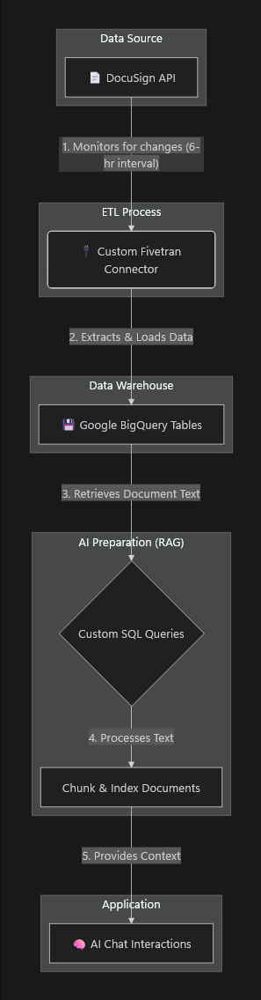
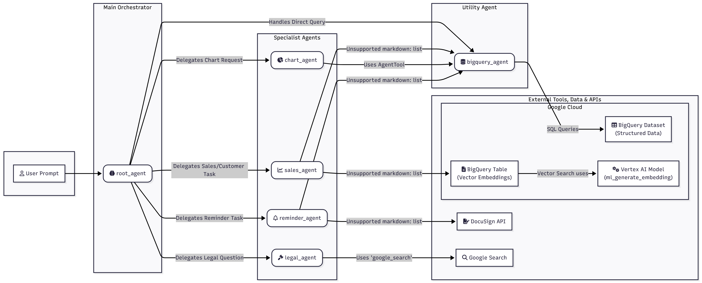
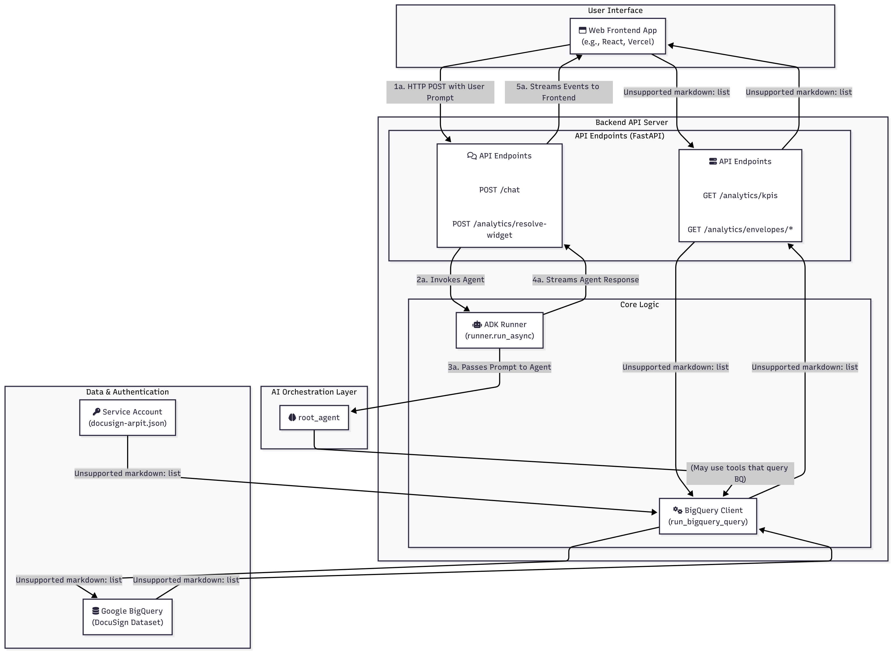

## INSPIRATION

**DocuLytics** was born from the need to transform raw DocuSign envelope data into actionable insights.  In a world where **document workflows** are **critical** for business operations, we envisioned an AI-powered platform that not only analyzes envelope metrics but also provides **intelligent chat interactions** to answer complex queries about document processes. 
The inspiration came from the challenges of manual data analysis in legal and sales environments, where understanding cycle times, status distributions, and user behaviors can drive significant efficiency gains.

## What It Does

**DocuLytics** is a comprehensive analytics and AI chat platform for DocuSign data. It provides:

- **Real-time Analytics Dashboard**: Visualizes key performance indicators (KPIs) such as envelope cycle times, daily sent vs. completed metrics, status distributions, and detailed envelope tables with filtering and pagination.
- **Custom Dashboard Builder**: Enables users to create personalized dashboards by dragging and dropping widgets, configuring data sources, and customizing layouts for tailored analytics views and insights.
- **AI-Powered Chat Interface**: An intelligent chat system that leverages Google Generative AI and custom agents to answer questions about DocuSign data, generate charts, provide legal insights, set reminders, and assist with sales-related queries.
- **Modular Agent System**: Includes specialized sub-agents for BigQuery data retrieval, chart generation, legal document analysis, reminder management, and sales support.
- **Data Integration**: Connects to DocuSign via Fivetran for seamless data ingestion into BigQuery, ensuring up-to-date analytics.
- **Modern Web Interface**: A responsive Next.js frontend with components for dashboards, AI chat, and analytics widgets, supporting both local development and cloud deployment.

The platform enables users to explore DocuSign envelope data through natural language queries, automated insights, and interactive visualizations, making document workflow analysis accessible and intelligent.

## How We Built It

#### **Data Flow from DocuSign to BigQuery**
Our architecture is built on an automated pipeline that syncs DocuSign data into a queryable format and prepares it for our AI. The flow is visualized below.

  

<table>
  <tr>
    <td valign="top" width="200"><strong>1. DocuSign Event Trigger</strong></td>
    <td>Actions on a DocuSign envelope update data in the DocuSign API.</td>
  </tr>
  <tr>
    <td valign="top"><strong>2. Data Extraction</strong></td>
    <td>A custom Fivetran connector monitors the API, extracting new and updated data every 6 hours.</td>
  </tr>
  <tr>
    <td valign="top"><strong>3. Load into BigQuery</strong></td>
    <td>The connector loads this raw data into structured tables in Google BigQuery.</td>
  </tr>
  <tr>
    <td valign="top"><strong>4. RAG Pipeline</strong></td>
    <td>We run scheduled queries to pull document text from BigQuery, which is then chunked and indexed for efficient retrieval.</td>
  </tr>
  <tr>
    <td valign="top"><strong>5. AI Interaction</strong></td>
    <td>When a user chats with the AI, the indexed content provides the necessary context, enabling accurate, <strong>document-aware responses</strong>.</td>
  </tr>
</table>

## AI Agents 

  

**COMPONENTS**
<table>
  <tr>
    <td valign="top" width="220"><strong>Root Orchestrator</strong></td>
    <td><code>root_agent</code> that receives the user prompt and decides which specialist agent should handle it.</td>
  </tr>
  <tr>
    <td valign="middle" rowspan="4"><strong>Specialist Agents</strong></td>
    <td><code>chart_agent</code>: Creates data-driven visualizations from BigQuery results (e.g., bar/line charts for KPIs).</td>
  </tr>
  <tr>
    <td><code>sales_agent</code>: Handles sales/customer operations and lookups; may enrich answers via BigQuery or external sources.</td>
  </tr>
  <tr>
    <td><code>reminder_agent</code>: Manages reminder or follow-up tasks (e.g., set a reminder to check an envelope’s status).</td>
  </tr>
  <tr>
    <td><code>legal_agent</code>: Focuses on legal/document questions, often using RAG over document text.</td>
  </tr>
  <tr>
    <td valign="top"><strong>Utility Agent</strong></td>
    <td><code>bigquery_agent</code>: Shared, low-level data access layer used by other agents for SQL queries and vector search.</td>
  </tr>
  <tr>
    <td valign="middle" rowspan="5"><strong>External Tools, Data & APIs</strong></td>
    <td>BigQuery Dataset (structured data): Envelope, document, custom_fields, and recipients tables.</td>
  </tr>
  <tr>
    <td>BigQuery Table (vector embeddings): Stores text chunk embeddings for Retrieval-Augmented Generation (RAG).</td>
  </tr>
  <tr>
    <td>Vertex AI Embedding model: Generates vector embeddings for queries and document chunks.</td>
  </tr>
  <tr>
    <td>DocuSign API: Optional direct lookups or actions when needed beyond the analytics warehouse.</td>
  </tr>
  <tr>
    <td>Google Search: Fallback for external/public knowledge when appropriate.</td>
  </tr>
</table>

#### Decision Flow
1. A user submits a prompt to the backend chat endpoint. The backend initializes a session (via the runner) and forwards the prompt to the `root_agent`.
2. The `root_agent` performs intent classification and routing:
	 - Direct data questions (counts, trends, KPIs) → delegate to `bigquery_agent` or `chart_agent`.
	 - Visualization requests ("show me a bar chart of completed envelopes by week") → `chart_agent`.
	 - Sales/customer tasks ("find the latest signed agreement for ACME") → `sales_agent` (may use BigQuery and/or DocuSign API).
	 - Reminders ("remind me tomorrow to resend pending envelopes") → `reminder_agent`.
	 - Legal/document questions ("what clause mentions penalties?") → `legal_agent` with RAG.
3. The selected specialist agent executes its plan and calls the `bigquery_agent` as needed for:
	 - Parameterized SQL over the structured dataset.
	 - Vector search over the embeddings table for RAG.
4. The agent composes a structured response (text answer and/or a chart/widget spec) and returns it to the `root_agent`, which finalizes the reply for the frontend.

#### Data Retrieval (SQL)
- `bigquery_agent` issues parameterized SQL queries against the structured dataset (envelopes, documents, custom_fields, recipients).
- Results are returned as typed rows, then serialized by the backend for API responses or fed to agents for reasoning.

#### Retrieval-Augmented Generation (RAG)
- Documents are periodically processed (every X hours) from BigQuery:
	1) Run custom queries to select relevant documents.
	2) Split content into chunks and compute embeddings using a Vertex AI embedding model.
	3) Store chunk vectors and metadata in a BigQuery embeddings table.
- At query time (e.g., by `legal_agent`):
	1) Generate an embedding for the user query.
	2) Perform vector similarity search in BigQuery to retrieve top relevant chunks.
	3) Build a grounded prompt with retrieved context and call the generative model to produce the answer.

#### Charts and Widgets
- When the `chart_agent` is selected, it typically :-
	- Runs an aggregate SQL (via `bigquery_agent`).
	- Returns a chart specification (data series + chart type + options) to the backend.
	- The frontend consumes this spec to render an interactive chart (e.g., via the resolve-widget flow).

#### DocuSign API and Google Search
- For scenarios not fully covered by the warehouse :-
	- DocuSign API may be queried (e.g., real-time envelope metadata not yet synced).
	- Google Search can augment answers with public knowledge when allowed and relevant.

#### Error handling and Fallbacks
- If an agent encounters an error (query failure, empty results, permissions), the `root_agent` can :-
	- Fall back to a simpler explanation.
	- Ask a clarifying question to the user.
	- Route the task to another agent better suited to the request.

#### Why This Design
- The `root_agent` keeps user experience coherent whilst leveraging specialized capabilities.
- Centralizing data access in `bigquery_agent` ensures consistent schemas, safe parameterization, and reusable logic for both SQL analytics and vector search.

## Frontend and Backend Design

**Backend** (FastAPI) — main routes :-

  

<table>
  <tr>
    <td valign="top" width="400"><code><strong>GET</strong> /analytics/kpis</code></td>
    <td>Returns high-level dashboard KPIs aggregated from BigQuery via the <code>analytics</code> module.</td>
  </tr>
  <tr>
    <td valign="top"><code><strong>GET</strong> /analytics/envelopes/cycle-time-by-document</code></td>
    <td>Returns cycle time series grouped by document type (accepts <code>limit</code> query param).</td>
  </tr>
  <tr>
    <td valign="top"><code><strong>GET</strong> /analytics/envelopes/daily-sent-vs-completed</code></td>
    <td>Returns time series of envelopes sent vs completed (accepts <code>days</code> param).</td>
  </tr>
  <tr>
    <td valign="top"><code><strong>GET</strong> /analytics/envelopes/status-distribution</code></td>
    <td>Returns recent status distribution counts (accepts <code>limit</code> param).</td>
  </tr>
  <tr>
    <td valign="top"><code><strong>GET</strong> /analytics/envelopes/table</code></td>
    <td>Returns paginated envelopes table with optional search and status filters (<code>limit</code>, <code>page</code>, <code>q</code>, <code>status</code>).</td>
  </tr>
  <tr>
    <td valign="top"><code><strong>POST</strong> /chat</code></td>
    <td>Main chat endpoint used by the AI chat UI. Accepts a JSON body with <code>message</code> and optional <code>history</code>. The backend streams events from the agent runner back to the frontend as Server-Sent Events (SSE).</td>
  </tr>
  <tr>
    <td valign="top"><code><strong>POST</strong> /analytics/resolve-widget</code></td>
    <td>Used by the frontend when the user asks for a chart or text-insight. The backend runs the widget/agent flow and returns a structured payload containing <code>text</code> and <code>charts</code> (chart specs and data).</td>
  </tr>
</table>

Notes on Backend modules
- `backend/analytics.py` — wraps BigQuery queries and transformations; all analytics GET routes delegate to functions in this module.
- `backend/chat.py` — coordinates the ADK `root_agent` runner, streams chat responses via SSE for `/chat`, and resolves chart/widget requests for `/analytics/resolve-widget`.

**Frontend** features and How They Communicate :-
- **AI Chat UI**
	- Sends free-form prompts to `/chat` and receives a streamed response. The frontend opens an SSE connection and progressively displays text, suggestions, or structured payloads produced by the agents.

- **AI Chart / Dashboard Builder**
	- The Dashboard Builder allows users to configure widgets and request on-demand charts Based on drag and drop components. The AI Chart feature can also be invoked from chat (or from a dashboard) to auto-generate chart specs from natural language prompts.
	- The frontend calls POST `/analytics/resolve-widget` with a `prompt`, `kind` (e.g., `chart` or `text-insight`), and optional `chartType`. The backend runs the agent to translate the prompt into a structured chart spec (series, labels, and chart type) and/or a text insight.

## Open Source Engagement 

- Since this connector has an actual industry use case, we plan to open a PR to the Fivetran-connector-sdk GitHub repository, adding our connector, so that people working on the same thing can benefit from it.

## Challenges we ran into

- **AI Agent Coordination**: Integrating multiple specialized agents (BigQuery, chart, legal, reminder, sales) while maintaining coherent responses and avoiding conflicts in the chat system.

- **Implementing efficient and Automated RAG system**: Resolving certificate verification errors with Google APIs (oauth2.googleapis.com) in containerized environments required installing CA certificates and proper credential management.

- **Cloud Run Deployment**: Configuring the container to listen on the correct port (PORT environment variable) and handling startup timeouts in a serverless environment posed an issue while trying to deploy on Google Cloud.

## Accomplishments that We're Proud of

- **AI-Powered Insights**: Implemented a sophisticated chat system with specialized agents that can handle complex queries about DocuSign data.

- **Comprehensive Analytics**: Developed detailed analytics endpoints covering KPIs, cycle times, status distributions, and interactive tables.

## What We Learned

- **Creating AI agents**: Learned how to effectively integrate Google Generative AI and ADK into a FastAPI application, including session management and agent coordination.

- **Data Pipeline Design**: Understood the importance of reliable data ingestion and the challenges of syncing external APIs like DocuSign into analytics platforms using fivetran as a connector and BigQuery as a Data Lake.

## What's next for DocuLytics

- **Enhanced AI Capabilities**: Integrate more advanced AI models and expand agent capabilities for deeper document analysis and predictive insights.

- **Advanced Visualizations**: Implement more sophisticated charting libraries and interactive dashboards with real-time updates.

- **User Authentication and Multi-Tenancy**: Add user management, role-based access control, and support for multiple organizations.Supported

- **API Expansion**: Expose more endpoints for third-party integrations and covering more docusign content

